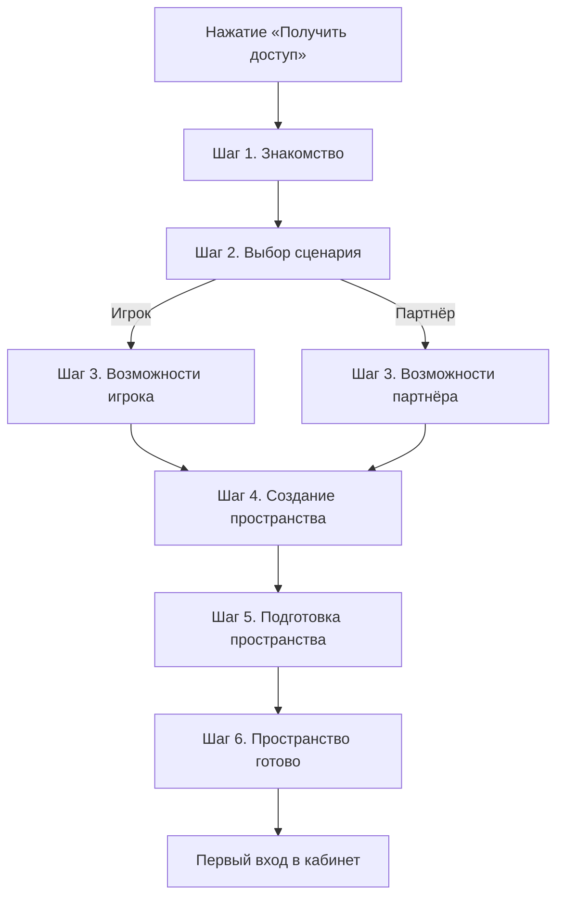

# VX House — сценарий получения доступа

> Статус: продуктовая спецификация пользовательского опыта.  
> Основание: [PRODUCT.md](./PRODUCT.md).  
> Назначение: определить единый пользовательский путь от нажатия «Получить доступ» до первого осмысленного действия в личном кабинете.

## Ключевое решение

Получение доступа к VX House не оформляется как обычная регистрация. Пользователь не «создаёт учётную запись на сайте», а **открывает личное пространство в закрытой платформе**.

Рекомендуемая модель:

- отдельный полноэкранный сценарий вместо модального окна;
- шесть коротких последовательных этапов;
- выбор роли до ввода данных;
- автоматическая демонстрация возможностей выбранного пространства до ввода контакта;
- минимум обязательных полей;
- вход без пароля через одноразовый код;
- базовый кабинет создаётся сразу после подтверждения контакта;
- проверка профиля и подбор специальных условий продолжаются уже внутри кабинета и не создают неопределённого ожидания;
- пользователь в любой момент понимает, где он находится, зачем нужен текущий шаг и что произойдёт дальше.

Такой подход сохраняет ощущение приватной платформы, но не превращает закрытость в искусственный барьер или высокомерный отбор.

## Цель сценария

Помочь подходящему совершеннолетнему пользователю быстро и уверенно перейти от интереса к первому входу в VX House.

Сценарий должен:

- занимать не более двух минут при отсутствии ошибок;
- содержать не более двух текстовых полей до подтверждения контакта;
- не требовать придумывать и запоминать пароль;
- заранее объяснять использование данных;
- честно показывать статус доступа и возможной проверки;
- разделять опыт игрока и партнёра без создания двух разных продуктов;
- завершаться не формальным сообщением об успехе, а входом в полезное личное пространство.

## Основной пользовательский путь

В текущем прототипе пользователь принимает **два решения** — выбирает сценарий и указывает данные. Знакомство, демонстрация возможностей и подготовка пространства не запрашивают дополнительных данных и не воспринимаются как шаги анкеты. Подтверждение контакта подключается позднее вместе с серверной частью и не имитируется в интерфейсе.

## Общая концепция интерфейса

### Формат

Сценарий открывается как самостоятельная полноэкранная среда. Это подчёркивает переход с публичного сайта внутрь цифрового продукта.

На экране постоянно присутствуют:

- логотип VX House;
- действие «Вернуться на главную»;
- спокойный индикатор этапа с ясной формулировкой «Шаг N из 6»;
- ссылка на поддержку;
- краткая информация о приватности и возрастном ограничении;
- единая центральная рабочая область.

### Индикатор этапа

Вместо жёсткой полосы регистрации используются шесть смысловых точек:

1. **Знакомство**;
2. **Сценарий**;
3. **Возможности**;
4. **Профиль**;
5. **Подготовка**;
6. **Доступ**.

Текущий этап выделяется фирменным красным. Завершённый этап получает спокойную отметку. На мобильном экране остаются только точки и название текущего этапа.

### Визуальный образ

- почти чёрный фон с едва заметным тёплым красным свечением;
- крупная типографика и много свободного пространства;
- одна основная стеклянная поверхность вместо набора одинаковых карточек;
- продуктовые фрагменты личного кабинета на фоне, связанные с выбранным сценарием;
- красный цвет только для основного действия, активного состояния и прогресса;
- зелёный только для подтверждённого или безопасного состояния;
- никаких игровых автоматов, фишек, джекпотов, таймеров и визуального давления.

### Поведение

- введённые данные сохраняются при возврате на предыдущий экран;
- кнопка продолжения активируется только после выполнения понятных условий;
- ошибки показываются рядом с полем и объясняют способ исправления;
- нажатие Enter выполняет главное действие, если данные корректны;
- пользователь может выйти из сценария без предупреждения о «потере возможности»;
- после подтверждения контакта сценарий можно безопасно продолжить на другом устройстве.

## Шаг 1. Знакомство

### Назначение

Обозначить переход из публичного сайта в закрытую продуктовую среду и спокойно объяснить предстоящий путь.

### Главный заголовок

**Добро пожаловать в VX House**

### Подзаголовок

Короткое объяснение: пользователь подготовит подходящее пространство, укажет минимальный контакт и подтвердит доступ. Процесс занимает около двух минут, не требует пароля и длинной анкеты.

### Данные пользователя

Ничего вводить не требуется.

### Основное действие

**Начать**

### Второстепенное действие

**Вернуться** — возвращает на главную страницу.

### Что происходит после действия

Пользователь переходит к выбору сценария в рамках того же полноэкранного процесса без перезагрузки страницы.

### Что чувствует пользователь

Спокойствие, контроль и доверие. Он понимает объём процесса до начала и не видит перед собой форму регистрации.

### Зачем нужен шаг

Он отделяет публичное знакомство с продуктом от входа в платформу и устраняет резкий переход к сбору данных.

### Компоненты и анимация

- логотип VX House;
- индикатор «Шаг 1 из 6»;
- крупный приветственный заголовок;
- краткое описание длительности и принципа входа;
- основная кнопка и спокойная ссылка возврата;
- мягкое появление текста и действия; при уменьшенном движении — только смена прозрачности.

## Шаг 2. Выбор сценария

### Назначение

Сразу определить контекст пользователя и показать, что VX House адаптирует пространство под его задачу.

### Главный заголовок

**Как вы хотите использовать VX House?**

### Подзаголовок

Выберите сценарий — мы подготовим подходящее пространство и покажем только нужные возможности.

### Варианты

#### Для себя

Описание: «Личный кабинет, специальные условия, поддержка и история взаимодействия».

#### Для сотрудничества

Описание: «Партнёрское пространство, статусы, условия и прямой канал связи».

Названия «Играть» и «Зарабатывать» не используются: они звучат рекламно, сужают смысл продукта и могут создавать нежелательные ассоциации.

### Данные пользователя

Пользователь выбирает один из двух сценариев. Никаких персональных данных на этом экране не запрашивается.

### Основное действие

**Продолжить**

Кнопка становится доступной после выбора сценария.

### Второстепенное действие

**У меня уже есть доступ**

Действие переводит пользователя к беспарольному входу по контакту.

### Что происходит после действия

Выбранный сценарий сохраняется, а следующий экран автоматически показывает соответствующие возможности. Пользователь ничего дополнительно не настраивает и не выбирает.

### Что чувствует пользователь

Контроль и персональное отношение. Платформа не заставляет заполнять универсальную анкету, а сначала спрашивает о намерении.

### Зачем нужен шаг

Выбор позволяет персонализировать кабинет, приветствие и дальнейшие действия без дополнительных вопросов до первого входа.

### Компоненты

- логотип и компактная навигация;
- заголовок и поясняющий текст;
- две крупные сценарные области с иконкой, названием и описанием;
- смысловой индикатор этапа «Шаг 2 из 6»;
- основная и второстепенная кнопки;
- подпись «Только для совершеннолетних пользователей».

Сценарные области выглядят как фрагменты будущего продукта, а не как тарифные карточки. Выбранная область слегка раскрывается и показывает миниатюру соответствующего кабинета.

### Анимация

- мягкое появление контента снизу с небольшой дистанцией;
- спокойное изменение границы и внутреннего свечения при выборе;
- миниатюра кабинета проявляется через прозрачность, без резкого масштабирования;
- при уменьшенном движении остаётся только смена цвета и состояния.

## Шаг 3. Что вы получите

### Назначение

Показать ценность будущего пространства до запроса контактных данных и сделать переход к созданию профиля осмысленным. Содержимое определяется выбранным на предыдущем шаге сценарием автоматически.

Пользователь **не выбирает преимущества вручную**: экран является короткой демонстрацией уже подготовленного для него контекста.

### Сценарий «Игрок»

#### Главный заголовок

**Ваше пространство игрока**

#### Подзаголовок

После создания профиля вам будут доступны основные возможности VX House в одном личном пространстве.

#### Возможности

1. **Личный кабинет** — статус профиля, доступные функции и важные обновления в одном месте.
2. **Персональные условия** — доступные предложения и условия, сформированные с учётом профиля пользователя.
3. **Поддержка** — прямой доступ к сопровождению и истории обращений.
4. **История активности** — основные события, изменения статуса и действия внутри платформы.
5. **Привилегии участника** — уровень, доступные преимущества и новые возможности аккаунта.

### Сценарий «Партнёр»

#### Главный заголовок

**Ваше партнёрское пространство**

#### Подзаголовок

После создания профиля вы получите единое пространство для управления сотрудничеством с VX House.

#### Возможности

1. **Партнёрский кабинет** — основная информация о сотрудничестве, статусах и доступных действиях.
2. **Условия сотрудничества** — понятное отображение актуальных условий и формата взаимодействия.
3. **Статус взаимодействия** — текущий этап работы и следующие необходимые действия.
4. **Поддержка партнёров** — прямая связь с командой VX House по вопросам сотрудничества.
5. **История активности** — история изменений, запросов и основных событий партнёрского профиля.

### Данные пользователя

Ничего вводить не требуется. Выбранный сценарий сохраняется при переходах назад и вперёд.

### Основное действие

**Продолжить создание пространства**

### Второстепенное действие

**Назад к выбору**

### Что происходит после действия

Пользователь переходит к имени и электронной почте. При возврате сохраняются выбранный сценарий и ранее введённые данные.

### Что чувствует пользователь

Понимание ценности и уверенность в следующем шаге: контакт нужен для конкретного личного пространства, которое уже показано, а не для безликой регистрации.

### Зачем нужен шаг

Экран убирает резкий переход от выбора роли к форме, заранее доказывает продуктовую ценность и усиливает желание завершить создание пространства.

### Компоненты

- один крупный стеклянный интерфейсный блок будущего кабинета;
- асимметричная область основной возможности;
- встроенные строки остальных возможностей;
- индикатор подготовленного сценария и защищённого доступа;
- основная кнопка и возврат к выбору.

Композиция не должна выглядеть как стандартная сетка одинаковых маркетинговых карточек.

### Анимация

- весь интерфейсный блок мягко появляется снизу;
- возможности раскрываются короткой последовательностью;
- движение не блокирует действия;
- при уменьшенном движении элементы отображаются сразу без перемещения и каскада.

## Шаг 4. Создание личного пространства

Экран имеет одинаковую структуру для обоих сценариев, но меняет формулировки и фоновые продуктовые детали.

### Назначение

Получить минимальные данные для персонализации и безопасного беспарольного входа, не превращая процесс в анкету.

### Главный заголовок

Для личного сценария: **Создадим ваше пространство**  
Для партнёрского сценария: **Откроем пространство для сотрудничества**

### Подзаголовок

Укажите, как к вам обращаться и куда отправить код подтверждения. Это займёт меньше минуты.

### Данные пользователя

Обязательные:

- имя;
- адрес электронной почты.

Под полем электронной почты показывается объяснение: «Используем для входа, уведомлений о статусе и восстановления доступа».

Также пользователь подтверждает:

- что ему исполнилось 18 лет;
- согласие с условиями использования и политикой конфиденциальности.

Согласия не должны быть предварительно отмечены. Ссылки на документы открываются без потери введённых данных.

Телефон, страна, никнейм, дата рождения, название компании и другие сведения **не запрашиваются до первого входа**, если они не являются обязательными по правовым или операционным причинам. Необходимость дополнительных данных должна быть отдельно подтверждена продуктом и юридической проверкой.

### Основное действие

**Продолжить**

### Второстепенное действие

**Назад к возможностям**

### Что происходит после действия

Интерфейс локально проверяет, что имя и электронная почта заполнены корректно, сохраняет значения в состоянии онбординга и переводит пользователя к подготовке пространства. Настоящая отправка данных и подтверждение контакта в прототипе не выполняются.

### Что чувствует пользователь

Лёгкость и безопасность. От него просят только понятный минимум и сразу объясняют назначение данных.

### Зачем нужен шаг

Имя позволяет персонализировать пространство, а подтверждённый контакт становится безопасным способом входа без пароля.

### Компоненты

- одно стеклянное поле-контейнер с двумя последовательно расположенными полями;
- заметные постоянные подписи над полями;
- пояснение о назначении электронной почты;
- отдельное подтверждение возраста;
- согласие с документами;
- компактный блок доверия «Без пароля · Данные защищены · Настройки можно изменить»;
- основная и второстепенная кнопки.

Плейсхолдеры не заменяют подписи. Обязательность поля объясняется до ошибки.

### Анимация

- плавный переход заголовка и рабочей области между сценариями;
- корректно заполненное поле получает спокойную отметку;
- ошибка появляется без тряски и вспышек;
- фон показывает едва заметный силуэт будущего кабинета выбранного типа.

## Шаг 5. Подготовка пространства

### Назначение

Показать, что платформа создаёт персональное рабочее пространство, а не просто обрабатывает форму.

### Главный заголовок

**Подготавливаем ваше пространство**

### Подзаголовок

Это займёт всего несколько секунд. Мы создаём ваш профиль и активируем выбранный сценарий.

### Данные пользователя

Ничего вводить не требуется.

### Основное действие

Пока идёт демонстрация подготовки, кнопка не показывается. После завершения появляется кнопка **Продолжить**, ведущая на Шаг 6.

### Второстепенное действие

На этом этапе второстепенное действие не требуется: процесс короткий и не запрашивает решения пользователя.

### Что происходит

Прототип локально и последовательно показывает четыре состояния:

1. «Проверка данных»;
2. «Создание профиля»;
3. «Подготовка личного кабинета»;
4. «Подключение возможностей».

Это визуальная демонстрация без серверных запросов. Вся последовательность занимает несколько секунд и не создаёт ложного ожидания внешнего результата.

### Что чувствует пользователь

Ожидание результата без тревоги. Пользователь видит конкретные действия системы и понимает, что его запрос принят.

### Зачем нужен шаг

Он создаёт смысловой мост между вводом контакта и готовым пространством, позволяя пользователю увидеть, как выбранный сценарий превращается в продуктовый интерфейс.

### Компоненты

- стеклянная карточка с четырьмя последовательными состояниями;
- текстовый статус текущего этапа и завершённые отметки;
- неинтерактивный макет кабинета;
- постепенно активирующиеся области «Профиль», «Специальные условия», «Поддержка» и «История активности»;
- финальное состояние и кнопка «Продолжить».

### Анимация

- последовательное появление локальных демонстрационных состояний;
- тонкая световая линия соединяет этапы;
- нет резких спиннеров, случайного прогресса и долгой искусственной задержки;
- при уменьшенном движении состояния обновляются без перемещения.

## Шаг 6. Пространство готово

### Назначение

Дать пользователю эмоционально спокойное завершение сценария и объяснить, что он увидит после входа.

### Главный заголовок

**Ваше пространство VX House готово**

### Подзаголовок

Профиль подготовлен. Личный кабинет активирован. Теперь вам доступны возможности платформы в соответствии с выбранным сценарием.

### Данные пользователя

Ничего вводить не требуется.

### Основное действие

**Перейти в VX House**

### Второстепенное действие

На самом экране второстепенное действие не используется. Все дальнейшие варианты появляются только в модальном окне после основного действия.

### Что происходит после действия

Поскольку в MVP ещё нет авторизации и внутренней платформы, кнопка не ведёт на несуществующую страницу. Она открывает доступное модальное окно **«Следующий этап разработки»** с честным объяснением статуса продукта.

Текст модального окна:

«Вы завершили сценарий знакомства с VX House.

Полноценный личный кабинет, авторизация и внутренняя платформа будут реализованы на следующих этапах разработки».

Действия в модальном окне:

- **Вернуться на главную**;
- **Закрыть**.

### Что чувствует пользователь

Завершённость, принадлежность и спокойное предвкушение. Не «форма отправлена», а «личное пространство готово».

### Зачем нужен шаг

Экран подтверждает успешный результат, демонстрирует будущий продукт и честно обозначает границу текущей версии без ложного перехода.

### Компоненты

- четыре завершённых статуса: «Профиль активирован», «Личный кабинет готов», «Выбранный сценарий подключён», «Пространство VX House создано»;
- реалистичный макет кабинета с профилем, специальными условиями, уровнем участника, поддержкой и историей активности;
- персонализированные данные и выбранный сценарий;
- одна основная кнопка;
- модальное окно со ссылкой на главную и действием закрытия.

### Анимация

- центральная панель кабинета мягко появляется как продолжение Шага 5;
- завершённые статусы и карточки кабинета проявляются короткой последовательностью;
- никакого конфетти, салюта или игровой награды;
- основная кнопка появляется после основного содержимого, но не блокируется анимацией;
- при уменьшенном движении все элементы отображаются сразу без перемещения.

## После онбординга. Первый вход в личный кабинет

### Назначение

Сразу доказать ценность продукта и дать одно осмысленное действие вместо экскурсии по всему интерфейсу.

### Главный заголовок

**Добро пожаловать в VX House**

### Подзаголовок

Ваше пространство уже работает. Завершите профиль, чтобы мы могли подготовить персональные условия.

Если дополнительные данные для выбранного сценария не нужны, подзаголовок меняется на: «Здесь собраны ваш статус, условия, история и поддержка».

### Данные пользователя

На первом экране данные не запрашиваются. Кабинет сначала показывает результат входа и доступные возможности.

### Основное действие

Для игрока: **Завершить профиль**  
Для партнёра: **Рассказать о сотрудничестве**

Это действие открывает отдельный короткий сценарий постепенного заполнения профиля. Его можно отложить без потери базового доступа.

### Второстепенное действие

**Открыть поддержку**

### Что происходит после действия

Пользователь либо начинает заполнять дополнительные данные, либо переходит в персональный канал поддержки. Основной кабинет остаётся доступен.

### Что чувствует пользователь

Ценность и контроль. Он сразу видит рабочий продукт, а не пустой экран или вторую длинную анкету.

### Зачем нужен шаг

Первое впечатление внутри продукта определяет доверие сильнее, чем успешное завершение регистрации. Пользователь должен сразу понять, куда вернуться и что здесь полезного.

### Компоненты

- приветственная панель, которая исчезает после первого осмысленного действия;
- карточка статуса профиля;
- карточка уровня участника или статуса сотрудничества;
- блок специальных условий со статусом «Подбираем» или «Доступны»;
- последние события;
- доступная персональная поддержка;
- уведомления;
- одно основное действие.

Состояние «Подбираем условия» обязательно содержит срок или объяснение следующего события. Нельзя оставлять пользователя с неопределённым «Ожидайте».

### Анимация

- кабинет появляется как продолжение макета, показанного на предыдущем экране;
- приветственная панель раскрывается один раз;
- нужный следующий шаг выделяется мягким контуром;
- фоновые элементы почти неподвижны;
- анимация не блокирует взаимодействие.

## Различия сценариев

### Личное пространство

После первого входа приоритеты:

1. статус профиля;
2. специальные условия;
3. уровень участника;
4. поддержка;
5. история и уведомления.

Дополнительные сведения собираются постепенно и только с объяснением пользы. Например: «Укажите страну, чтобы показать доступные для вашего региона условия».

### Партнёрское пространство

После первого входа приоритеты:

1. статус запроса на сотрудничество;
2. краткое описание следующего шага;
3. контакт ответственного представителя;
4. условия и документы;
5. история взаимодействия.

Название компании, роль, сайт проекта и формат сотрудничества запрашиваются уже внутри кабинета одним компактным сценарием. Пользователь сначала получает пространство и понимает контекст, затем предоставляет подробности.

### Изменение сценария

Пользователь может изменить роль до подтверждения контакта без потери данных. После создания аккаунта второй сценарий подключается из настроек кабинета; новый аккаунт не требуется.

## Вход для существующего пользователя

Действие «У меня уже есть доступ» использует тот же беспарольный принцип:

1. пользователь указывает электронную почту;
2. получает одноразовый код;
3. подтверждает его;
4. попадает сразу в кабинет.

Если контакт не найден, интерфейс сообщает: «Для этого адреса пространство ещё не создано» и предлагает **Получить доступ**. Формулировка не должна раскрывать существование аккаунта третьему лицу там, где это создаёт риск безопасности; окончательный текст определяется после оценки модели угроз.

В будущем после первого успешного входа можно предложить настроить ключ доступа устройства. Это предложение появляется внутри настроек безопасности, а не усложняет первое получение доступа.

## Состояния и исключения

### Неверный или истёкший код

- объяснить, что произошло;
- сохранить введённый адрес;
- предложить новый код;
- не обнулять весь сценарий;
- после нескольких ошибок не обвинять пользователя и не использовать тревожный красный фон.

Текст: «Код не подошёл или уже истёк. Отправьте новый — остальные данные сохранятся».

### Сообщение не пришло

Показать последовательные действия:

1. проверить адрес;
2. проверить папку нежелательной почты;
3. отправить код повторно;
4. изменить адрес;
5. обратиться в поддержку.

### Потеря соединения

Введённые данные сохраняются на устройстве на время сценария. После восстановления соединения пользователь продолжает с текущего экрана.

Текст: «Соединение прервалось. Данные сохранены — продолжим, когда связь восстановится».

### Подготовка занимает больше времени

Не держать пользователя на бесконечной загрузке. Показать подтверждённый результат и возможность выйти:

«Профиль создан. Завершаем настройку пространства и сообщим, когда оно будет готово».

### Доступ требует ручной проверки

Пользователь всё равно получает вход в базовый кабинет. Внутри отображаются:

- понятный статус проверки;
- причина проверки без раскрытия внутренних правил;
- ориентировочный срок;
- следующий шаг пользователя, если он нужен;
- канал поддержки.

Запрещено показывать только «Заявка на рассмотрении» без контекста и срока.

### Доступ недоступен

Сообщение остаётся уважительным и конкретным. Оно объясняет, можно ли исправить ситуацию, повторить запрос или обратиться в поддержку. Нельзя создавать впечатление наказания или проигрыша.

## Компонентная модель

Компоненты определяются по смыслу и переиспользуются в сценарии входа, подтверждения и настройке профиля.

### Каркас доступа

Содержит логотип, возврат, индикатор этапа, поддержку и рабочую область. Сохраняет положение основных действий между экранами.

### Выбор сценария

Интерактивная область с названием, объяснением и миниатюрой будущего пространства. Имеет состояния: обычное, наведение, фокус, выбрано, недоступно.

### Поле с объяснением

Всегда содержит видимую подпись, значение, пояснение о назначении данных и локальное сообщение об ошибке.

### Поле подтверждения

Принимает код как единое значение, поддерживает вставку и автоматическое заполнение, но визуально помогает различать позиции.

### Индикатор доверия

Коротко объясняет безопасность и приватность. Не используется как рекламный бейдж и не содержит неподтверждённых обещаний.

### Состояние процесса

Показывает только реальные действия системы и реальные завершённые этапы.

### Статус доступа

Используется в приветствии и кабинете. Всегда сочетает цвет, текст и значок, поэтому смысл не зависит только от цвета.

### Контекстная поддержка

Показывает помощь, соответствующую текущему шагу, и не отвлекает от основного действия.

## Принципы текстов

### Используем

- «Получить доступ»;
- «Создать пространство»;
- «Подтвердить контакт»;
- «Открыть личный кабинет»;
- «Профиль создан»;
- «Условия подбираются»;
- «Связаться с поддержкой».

### Не используем

- «Зарегистрироваться»;
- «Создать логин и пароль»;
- «Отправить форму»;
- «Заявка успешно отправлена» без объяснения следующего шага;
- «Верификация пользователя» в пользовательском тексте;
- «Эксклюзивный шанс»;
- «Успейте получить доступ»;
- «Гарантированная выгода»;
- англоязычные термины там, где есть ясный русский вариант.

Тон спокойный, точный и уважительный. Закрытость платформы выражается качеством сценария и персональным контекстом, а не дефицитом, таймерами или искусственной недоступностью.

## Анимационная система сценария

- переход между экранами: 300–500 мс;
- новый контент появляется в направлении движения пользователя;
- возврат визуально отражает обратное направление;
- главный контейнер сохраняет положение, чтобы интерфейс не «прыгал»;
- фоновые свечения движутся очень медленно и с малой амплитудой;
- подтверждение обозначается коротким изменением состояния, а не праздничным эффектом;
- ошибки не сопровождаются тряской;
- все действия доступны до окончания декоративной анимации;
- настройка уменьшенного движения полностью убирает перемещения, масштабирование и бесконечные эффекты.

## Мобильный сценарий

Мобильная версия является основной точкой проектирования.

- один столбец;
- заголовок и действие видны без горизонтальной прокрутки;
- сценарные области располагаются вертикально;
- клавиатура не перекрывает поле и основную кнопку;
- кнопка продолжения остаётся доступной после заполнения, но не закрывает пояснения и ошибки;
- поле кода помещается на экране шириной 320 пикселей;
- ссылки имеют достаточную область нажатия;
- фоновые продуктовые фрагменты упрощаются и не уменьшают контраст;
- возврат, поддержка и текущий этап остаются доступными на каждом экране.

На широком экране рабочая область занимает левую или центральную часть, а справа может показываться контекстный фрагмент будущего кабинета. На мобильном он переносится под основной контент или становится фоновым силуэтом.

## Доступность

- весь сценарий полностью проходит с клавиатуры;
- фокус после перехода устанавливается на заголовок нового экрана;
- ошибки связываются с соответствующими полями и озвучиваются;
- прогресс имеет текстовое описание;
- выбор сценария работает как единая группа вариантов;
- контраст текста и интерактивных состояний соответствует требованиям доступности;
- цвет не является единственным способом показать статус;
- код можно вставить целиком;
- предусмотрено автоматическое заполнение имени, электронной почты и одноразового кода;
- содержимое остаётся читаемым при увеличении до 200%;
- анимации учитывают предпочтение уменьшенного движения;
- время действия кода не ограничивает возможность спокойно запросить новый.

## Приватность, безопасность и ответственное использование

- до отправки данных объясняется их назначение;
- собирается только необходимый минимум;
- согласия не маскируются и не объединяются с рекламными рассылками;
- маркетинговые сообщения подключаются отдельным необязательным выбором уже внутри профиля;
- контакт частично скрывается на экране подтверждения;
- возрастное ограничение показано ясно;
- для личного сценария доступна ссылка на принципы ответственного использования;
- пользователь может обратиться в поддержку до создания аккаунта;
- юридические формулировки, состав согласий и необходимость дополнительных проверок утверждаются до реализации сценария;
- закрытый характер платформы не используется для давления или обхода требований конкретного региона.

## Критерии качества

Сценарий считается успешным, если:

- пользователь понимает разницу между личным и партнёрским пространством;
- большинство пользователей завершают путь без обращения к поддержке;
- обязательные данные помещаются на одном экране;
- пользователь знает, зачем нужен каждый запрошенный элемент данных;
- существующий аккаунт не становится тупиковой ошибкой;
- после подтверждения контакта не требуется повторный вход;
- ручная проверка не скрывает кабинет и не создаёт неопределённости;
- первый экран кабинета содержит полезное состояние и один понятный следующий шаг;
- сценарий работает на мобильном устройстве, с клавиатуры и при уменьшенном движении;
- интерфейс не выглядит как форма регистрации или азартная рекламная механика.

## Продуктовые метрики

Оценивать необходимо не только завершение формы, но и качество первого опыта:

- доля нажатий «Получить доступ», после которых выбран сценарий;
- доля пользователей, начавших и завершивших подтверждение контакта;
- среднее время до создания пространства;
- количество повторных отправок кода;
- количество возвратов для исправления контакта;
- доля первых входов сразу после создания пространства;
- доля пользователей, выполнивших первое полезное действие в кабинете;
- обращения в поддержку на каждом этапе;
- раздельные показатели для личного и партнёрского сценариев;
- причины отказа, если пользователь добровольно решит их сообщить.

Метрики не используются для создания давления, скрытия второстепенных действий или усложнения выхода.

## Границы минимальной версии

В первую версию входят:

- полноэкранный сценарий доступа;
- приветственный экран с ясным объяснением процесса;
- выбор личного или партнёрского пространства;
- автоматическая демонстрация возможностей выбранного сценария;
- имя и электронная почта;
- подтверждение возраста и обязательных документов;
- одноразовый код;
- создание или вход в существующее пространство;
- экран готовности;
- первый вход в кабинет;
- понятные ошибки и повторная отправка кода;
- ссылка на поддержку;
- базовый статус возможной проверки.

В первую версию не входят:

- пароль;
- вход через социальные сети;
- длинная анкета до первого входа;
- обязательный телефон без подтверждённой необходимости;
- загрузка документов до объяснения причины;
- сложная персонализация;
- игровые или бонусные механики;
- навязчивая экскурсия по кабинету.

## Будущее развитие

После проверки минимальной версии можно добавить:

- ключ доступа устройства для быстрого и безопасного входа;
- продолжение сценария на другом устройстве;
- приглашение от персонального представителя;
- подключение второго сценария к существующему аккаунту;
- персонализированное приветствие по источнику приглашения;
- подтверждение личности только в тех случаях, где оно действительно необходимо;
- сохранение незавершённого дополнительного профиля;
- локализацию после утверждения русскоязычного сценария;
- более точную адаптацию кабинета под роль пользователя.

Любое расширение должно сокращать неопределённость или повышать безопасность. Оно не должно добавляться только ради ощущения эксклюзивности.

## Решения, которые нужно подтвердить до реализации

1. В каких регионах доступна платформа и какие возрастные требования действуют в каждом из них?
2. Нужна ли ручная проверка для личного и партнёрского сценариев?
3. Какие данные обязательны по правовым и операционным причинам до первого входа?
4. Какой срок проверки можно честно показывать пользователю?
5. Как устроена поддержка до и после создания аккаунта?
6. Какие условия доступны в базовом кабинете до завершения профиля?
7. Нужен ли телефон как резервный способ восстановления доступа?
8. Какие документы пользователь должен принять и могут ли они различаться по региону?

До ответа на эти вопросы описанный пользовательский сценарий остаётся основным направлением, а формулировки о сроках и доступности считаются предварительными.

---

Этот документ имеет приоритет для проектирования страницы получения доступа, беспарольного входа, первого приветствия и начального состояния личного кабинета. Изменения сценария сначала фиксируются здесь, затем переходят в визуальный дизайн и реализацию.
