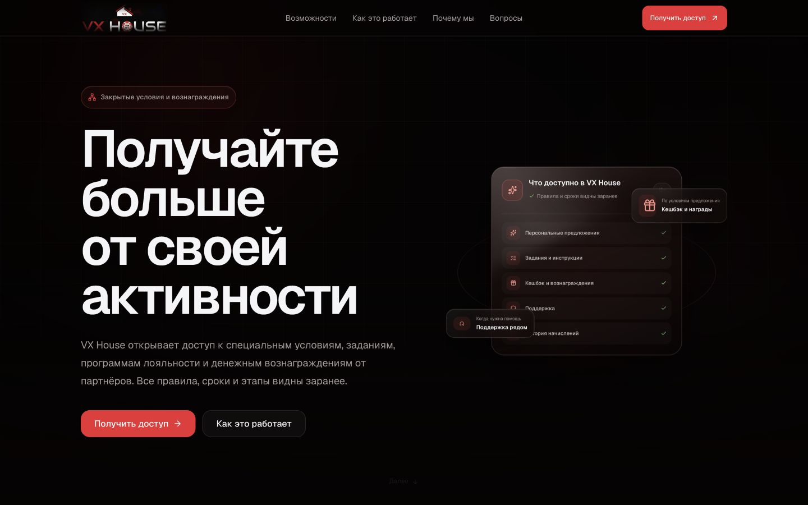
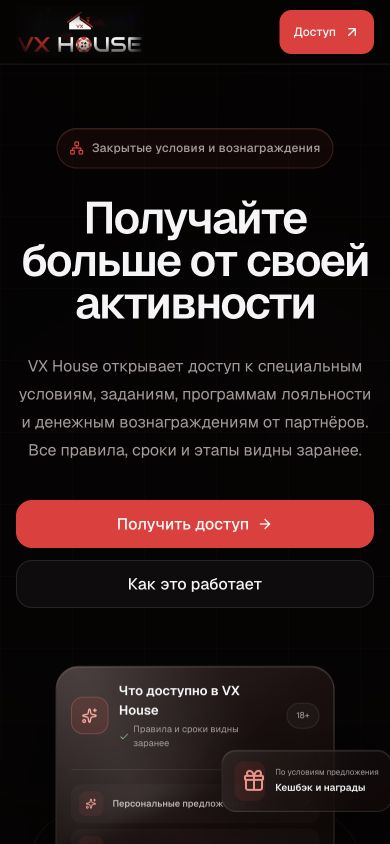

# Отчёт о переработке структуры и текстов лендинга

## Результат

Лендинг VX House переписан без редизайна, изменения дизайн-системы и вмешательства в регистрацию. Новая подача объясняет ценность платформы через конкретные предложения, задания, инструкции, вознаграждения, поддержку и историю действий.

## Изменённые секции

### Шапка

Навигация:

- «Возможности»;
- «Как это работает»;
- «Почему мы»;
- «Вопросы».

Основное действие: «Получить доступ». Все кнопки получения доступа ведут на `/access`.

### Первый экран

Надзаголовок: «Закрытые условия и вознаграждения».

Заголовок: «Получайте больше от своей активности».

Описание: «VX House открывает доступ к специальным условиям, заданиям, программам лояльности и денежным вознаграждениям от партнёров. Все правила, сроки и этапы видны заранее.»

Действия:

- «Получить доступ»;
- «Как это работает».

Визуальный блок показывает:

- персональные предложения;
- задания и инструкции;
- кешбэк и вознаграждения;
- поддержку;
- историю начислений.

### Возможности VX House

Надзаголовок: «Возможности VX House».

Заголовок: «Всё необходимое в одном месте».

Описание: «Вы видите доступные предложения, заранее знакомитесь с условиями, выполняете необходимые действия и отслеживаете вознаграждения в личном кабинете.»

Карточка игрока:

- метка: «Для игрока»;
- заголовок: «Специальные условия и вознаграждения»;
- описание: «Получайте доступ к предложениям партнёров, выполняйте понятные задания и получайте кешбэк, бонусы и другие вознаграждения по условиям программы.»;
- пункты: условия известны заранее, пошаговые инструкции, история заданий и начислений, поддержка на каждом этапе.

Карточка партнёра:

- метка: «Для партнёра»;
- заголовок: «Готовые сценарии и сопровождение»;
- описание: «Получайте прогнозы, материалы и рабочие сценарии, отслеживайте статусы и обращайтесь за помощью внутри платформы.»;
- пункты: прогнозы и материалы, понятные рабочие сценарии, контроль статусов, поддержка и сопровождение.

Граница продукта: «VX House не принимает ставки и не хранит пользовательские средства. Все действия выполняются на стороне партнёрских сервисов.»

### Как это работает

Надзаголовок: «Как это работает».

Заголовок: «Четыре простых шага».

Описание: «После регистрации вы сразу видите доступные возможности и условия участия.»

Шаги:

1. «Создайте аккаунт» — выберите роль, укажите основные данные и получите доступ к личному кабинету.
2. «Выберите предложение» — ознакомьтесь с условиями, сроками и возможным вознаграждением до начала участия.
3. «Выполните инструкции» — следуйте пошаговому заданию и отправьте результат на проверку.
4. «Получите вознаграждение» — после подтверждения результат и начисление появятся в личном кабинете.

### Личный кабинет

Надзаголовок: «Личный кабинет».

Заголовок: «Всё важное видно сразу».

Описание: «Предложения, задания, вознаграждения, поддержка и история собраны в одном кабинете. Вы всегда знаете текущий статус и следующий шаг.»

Демонстрация интерфейса переписана без вымышленных достижений и показывает назначение основных разделов.

### Почему VX House

Надзаголовок: «Почему VX House».

Заголовок: «Больше условий. Меньше неопределённости.»

Описание: «Мы собрали предложения, задания, поддержку и систему вознаграждений в одном пространстве, чтобы пользователь заранее понимал правила и видел историю каждого действия.»

Карточки:

- «Условия, которых нет в открытом доступе»;
- «Прозрачные вознаграждения»;
- «Понятные инструкции»;
- «Быстрая поддержка»;
- «История всех действий»;
- «Проверенные партнёрские программы».

### Ответственное участие

Заголовок: «Участвуйте осознанно».

Текст: «VX House предназначен только для совершеннолетних пользователей. Участие не является способом гарантированного заработка. Перед началом всегда изучайте условия предложения и оценивайте возможные риски.»

Короткие правила:

- не используйте заёмные средства;
- устанавливайте личные лимиты;
- обращайтесь в поддержку при возникновении вопросов.

Граница продукта: «VX House не принимает ставки, депозиты и не хранит игровой баланс.»

### Вопросы и ответы

Надзаголовок: «Вопросы и ответы».

Заголовок: «Главное перед регистрацией».

Описание: «Коротко о возможностях VX House, условиях участия и работе личного кабинета.»

Механика аккордеона и содержание вопросов сохранены для отдельного этапа переработки FAQ.

### Финальный призыв

Заголовок: «Посмотрите, какие возможности доступны вам».

Описание: «Создайте аккаунт, выберите роль и получите доступ к предложениям VX House.»

Кнопка: «Получить доступ».

Дополнительная строка: «Регистрация занимает несколько минут.»

### Подвал

Добавлены ссылки:

- «Пользовательское соглашение»;
- «Политика конфиденциальности»;
- «Ответственное участие»;
- «Поддержка».

Маркировка «18+» вынесена в заметный компактный элемент. Юридический текст сокращён до границы продукта.

## Удалённые формулировки

Из основных секций удалены прежние заголовки и подписи:

- «Понятный путь к персональным условиям»;
- «Платформа лояльности и сотрудничества»;
- «Платформа, которая делает условия понятными»;
- «От условия до результата — один прозрачный маршрут»;
- «Доверие строится на ясности»;
- «Спокойный продукт с чёткими границами»;
- «Личный маршрут без догадок»;
- «Сотрудничество в едином контексте»;
- технические подписи о маршрутах, контексте и сущностях;
- стартовые рынки и технические детали обработки данных из блока ответственного участия.

FAQ не переписывался по условию задачи, поэтому его существующие вопросы и ответы сознательно оставлены без изменений.

## Метаданные и социальное превью

Title, description, Open Graph, Twitter Card и структурированное описание приведены к новому позиционированию. Создано новое фирменное социальное превью без игровых и казино-ассоциаций.

## Проверки

- Lint: успешно.
- Typecheck: успешно.
- Production build: успешно.
- SSR/static: 13 проверок успешно, 6 сценариев пропущены, так как требуют авторизованную базовую фикстуру; ошибок нет.
- Desktop smoke: 1440 × 900 — успешно.
- Mobile smoke: 320, 375, 390 и 430 px — успешно.
- Горизонтальный скролл: отсутствует на всех проверенных ширинах.
- Заголовок первого экрана: 4 строки при 320 px, 3 строки при 375–430 px.
- Карточки ролей: две колонки на desktop, одна колонка на mobile.
- Основной CTA: видим, высота области нажатия 48 px.
- Навигация, якоря и ссылки на `/access`: проверены.
- Ошибки в консоли браузера: не обнаружены.

## Найденные и устранённые проблемы

- Длинный заголовок «Больше условий. Меньше неопределённости.» мог выходить за границы на узких экранах. Добавлен корректный перенос длинных слов без изменения типографической системы.
- Четыре пункта навигации могли пересекаться с логотипом и CTA на планшетной ширине. Полная навигация теперь появляется только при достаточной ширине, при этом CTA остаётся доступен.
- SSR-проверка содержала ожидания старого текста. Контракт теста обновлён под новый лендинг.

## Контрольные снимки

